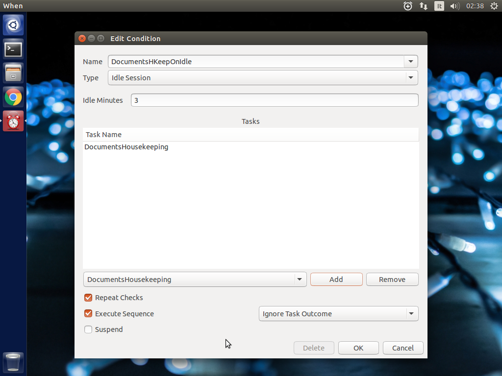

===========
User Manual
===========

Overview
========

**When** deals mainly with two types of entities, *Tasks* and *Conditions*.
These entity types are used to define *items* using the applet configuration
dialog boxes. Unlike similar applications, since *items* do not only represent
checks or commands, they are referenced by *name* throughout the user interface
of the applet. Item names must:

* begin with either a letter or a number
* contain only letters, numbers, underscores or dashes (no spaces)

and are case sensitive. A *Task* consists of a command, which will run in
the default shell, along with an environment and some hints on how to consider
it successful or not. *Tasks* correspond to a single command line each: this
means that they can consist of several shell commands each, as long as they can
fit on a single shell line -- for instance using shell separators (such as
semicolons, ``;``) or other conjunctions or disjunctions. A *Condition*
consists of an inherent *test* or associated *event*, a set of *Tasks* and
instructions on how tasks should run in case the test succeeds or the event
occurs. There is no concept of *failure* in conditions: a condition can either
occur or not.

The relationship between *Tasks* and *Conditions* consists in the possibility
for a condition to trigger a task: if the tests or events that determine the
condition are positive, then the tasks associated with that condition are
*very likely* to run -- execution of a task may be prevented either by the
**When** applet itself, if a previously run task in the same condition
occurrence [#condoccur]_ has failed (or succeeded) and the condition is set
to break in such an event, or by the underlying system if there is something
wrong with the task itself. The latter case is however normally interpreted as
a task *failure*.

More than one task can be associated to a condition: if tasks in a set that is
associated to a condition can be considered as *independent*, then the user
can choose to run the tasks simultaneously in multiple threads [#mthread]_
otherwise such tasks can run in sequence, and the sequence can be interrupted,
at user's choice, either on first task failure or on first task success.

This shows how a single *condition* can be associated to multiple *tasks*.
However a *task* can be "reused" in more than one condition: this is
particularly useful when a certain action is required to be triggered under
different circumstances -- say, at certain times *and* when an event occurs --
in which case both involved conditions may trigger the same task, possibly
within different task sets.

.. Note::
  Most of the `tokens` that decide whether or not a condition is verified are
  *enqueued* to be checked at intervals, which in the case of relatively
  "inexpensive" checks is at every clock tick, while in other cases is at
  longer intervals defined in the ``skip seconds`` configuration parameter.
  For example, conditions that depend on outcome of *external commands* are
  checked at longer intervals. Also, most [#deferredevents]_ system and
  session events cause the associated condition to be verified at the next
  clock tick instead of immediately. If such events occur *again* when the
  task set for the associated condition is already enqueued to be run, it is
  executed only once -- further attempts to enqueue it are simply skipped.

The **When** applet can be thought of as a main loop that incorporates a
*clock* and an *event listener*. Whenever the clock ticks, conditions are
evaluated, and when an event is caught a *token* is issued for the associated
condition to evaluate to `true`, so that the task set that it surrounds can
be run. Conditions that do not receive a token or whose test evaluates to
`false` are skipped for further evaluation.

*Conditions* can also be marked as `recurring`: if a condition has *not* been
instructed to *repeat checks*, the corresponding tests (and received tokens)
are skipped after the first time the associated task set has been triggered,
until the **When** applet is restarted -- either in a new session or by direct
intervention. Enabling the *repeat checks* feature, on the other side, allows
the condition to be `recurring`, or even `periodic` in the case of interval
based conditions.

There is another type of entity that can be defined, for which the naming
convention is the same as for *Tasks* and *Conditions*, that is
*Signal Handlers*: these can be used to define special *events* to be caught by
*Conditions* when certain *DBus Signals* are emitted. This advanced feature is
intended for users with a background on *DBus* specification and is not for
general use. [#busevent]_

The Applet
==========

The applet will show up in the indicator tray at startup, which would normally
occur at login if the user chose to add **When** to the startup applications.
It will read its configuration and start the scheduler in an unattended
fashion. Whenever one of the user defined conditions is met, the associated
tasks are executed. A small alarm clock icon will display in the indicator
tray, to show that the applet is running: by default it turns to an attention
sign when the applet requires attention. Also, the icon changes its shape
when the applet is *paused* (the clock is crossed by a slash) and when a
configuration dialog is open (the alarm clock shows a plus sign inside the
circle).

The icon grants access to the main menu, which allows the following basic
operations:

* open the Task_ editing dialog box
* open the Condition_ editing dialog box
* open the Settings_ dialog box
* show the `Task History`_ window
* *pause* and *resume* the scheduler
* show the *About* box
* quit the applet.

Where the *Task* and *Condition* editing boxes, the *Settings* dialog and the
*Task History* window might need some more detailed explanation, the other
operations should be pretty straightforward: the *Pause* entry pauses the
scheduler (preventing any condition to occur), *About...* shows information
about the applet and *Quit* shuts the applet down, removing the icon from the
top panel.

Some useful features can also be accessed from the `Command Line Interface`_,
including advanced tools: by default, when the applet is invoked with no
arguments, it just starts an instance showing the icon in the top panel (if
configured to do so), while the *CLI* allows operations on either a running
instance or the applet configuration.

.. _Task: Tasks_
.. _Condition: Conditions_
.. _Settings: Configuration_
.. _`Task History`: The History Window_

The following paragraphs illustrate the details of the applet user interface.

Tasks
=====

.. image:: _static/s02_hkeep-task01.png

Tasks are basically commands associated with an environment and checks to
determine whether the execution was successful or not. The interface lets the
user configure some basic parameters (such as the startup directory and the
*environment*) as well as what to test after execution (*exit code*, *stdout*
or *stderr*). The user can choose to look for the specified text within the
output and error streams (when *Exact Match* is unchecked, otherwise the entire
output is matched against the given value) and to perform a case sensitive
test, or to match a regular expression. In case a regular expression is chosen,
the applet will try to search *stdout* or *stderr* for the given pattern. In
case of regular expressions, when *Exact Match* is chosen, a match test is
performed at the beginning of the output text. Regular expression tests can be
case insensitive as well.

The environment in which the subprocess is run can either import the current
one (at **When** startup time), use its own variables or both.

The selected task (if any) can be deleted clicking the *Delete* button in the
dialog box. However the application will refuse to delete a task that is used
in a condition: remove the task reference from the condition first. Every task
must have an *unique name*, if a task is named as an existing task it will
replace the existing one. The name *must* begin with an alphanumeric character
(letter or digit) followed by alphanumerics, dashes and underscores.

**How to use the "Check for" option:** The applet can either ignore whatever
the underlying process returns to the caller by specifying *Nothing* in the
*Check for* group, or check

* exit code
* process output (*stdout*)
* process written errors (*stderr*)

to determine whether the process succeeded or failed. When the user chooses to
check for *Success*, the operation is considered successful *if and only if*
the process result (exit code, output, or error) corresponds to the user
provided value. Same yields for *Failure*: if *Failure* is chosen, only the
provided result will indicate a failure. For example, in the most common case
the user will choose to expect *Success* to correspond to an *Exit Code* of
``0`` (in fact the default choice), all other exit codes will indicate a
failure. And if the user chooses to expect *Failure* to be reported as the word
``Error`` in the error messages, whatever other error messages will be ignored
and the operation will turn out successful. Please note that since all commands
are executed in the default shell, expect an exit code different from ``0``
when the command is not found. With the ``/bin/sh`` shell used on Linux, the
*not found* code is ``127``.

Conditions
==========

There are several types of condition available:

1. **Interval based:** After a certain time interval the associated tasks are
   executed, if the condition is set to repeat checks, the tasks will be
   executed again regularly after the same time interval.
2. **Time based:** The tasks are executed when the time specification is
   matched. Time definitions can be partial, and in that case only the defined
   parts will be taken into account for checking: for instance, if the user
   only specifies minutes, the condition is verified at the specified minute
   for every hour if the *Repeat Checks* option is set.
3. **Command based:** When the execution of a specified command gives the
   expected result (in terms of **exit code**, **stdout** or **stderr**), the
   tasks are executed. The way the test command is specified is similar
   (although simpler) to the specification of a command in the *Task*
   definition dialog box. The command is run in the same environment (and
   startup directory) as **When** at the moment it was started.
4. **Idle time based:** When the session has been idle for the specified amount
   of time the tasks are executed. This actually is implemented as a shortcut
   to the command based condition built using the ``xprintidle`` command,
   which must be installed for the applet to work properly.
5. **Event based:** The tasks are executed when a certain session or system
   event occurs. The following events are supported:

   - *Startup* and *Shutdown*. These are verified when the applet (or session,
     if the applet is launched at startup) starts or quits.
   - *Suspend* and *Resume*, respectively match system suspension/hibernation
     and resume from a suspended state.
   - *Session Lock* and *Unlock*, that occur when the screen is locked or
     unlocked.
   - *Screensaver*, both entering the screen saver state and exiting from it.
   - *Storage Device Connect* and *Disconnect*, which take place when the user
     attaches or respectively detaches a removable storage device.
   - *Join* or *Leave a Network*, these are verified whenever a network is
     joined or lost respectively.
   - *Battery Charging*, *Discharging* or *Low*, respectively occurring when
     the power cord is plugged, unplugged or the battery is dangerously low:
     note that a *change* in power status has to arise for the condition to
     occur, and the *Low* condition is originated from the system.
   - *Command Line Trigger* is a special event type, that is triggered invoking
     the command line. The associated condition can be scheduled to be run at
     the next clock tick or immediately using the appropriate switch.

6. **Based on filesystem changes:** The tasks are run when a certain file
   changes, or when the contents of a directory or its subdirectories change,
   depending on what the user chose to watch -- either a file or a directory.
   A dialog box can be used to select what has to be watched. [#inotify]_
7. **Based on an user defined event:** The user can monitor system events by
   listening to *DBus* signals emitted on either the system bus or the session
   bus. [#busevent]_

Also, the condition configuration interface allows to decide:

* whether or not to repeat checks even after a task set has been executed --
  that is, make an action `recurring`;
* to run the tasks in a task set concurrently or sequentially: when tasks are
  set to run sequentially, the user can choose to ignore the outcome of tasks
  or to break the sequence on the first failure or success by selecting the
  appropriate entry in the box on the right -- tasks that don't check for
  success or failure will *never* stop a sequence;
* to *suspend* the condition: it will not be tested, but it's kept in the
  system and remains inactive until the *Suspend* box is unchecked.

The selected condition (if any) can be deleted clicking the *Delete* button in
the dialog box. Every condition must have an *unique name*, if a condition is
named as an existing one it will replace it. The name *must* begin with an
alphanumeric character (letter or digit) followed by alphanumerics, dashes and
underscores.

.. Note::
  - **Shutdown Conditions.** Because of the way applications are notified that
    the session is ending (first a ``TERM`` signal is sent, then a ``KILL`` if
    the first was unsuccessful), the *Shutdown* event is not suitable for long
    running tasks, such as file synchronizations, disk cleanup and similar
    actions. The system usually concedes a "grace time" of about one second
    before shutting everything down. Longer running tasks will be run if the
    users quits the applet through the menu, though. Same yields for *Suspend*:
    by specification, no more than one second is available for tasks to
    complete.
  - **Disabled Events.** Some events may not be supported on every platform,
    even on different Ubuntu implementations. *Screen Lock/Unlock* for instance
    does not follow very strict specifications, and could be disabled on some
    desktops. Thus one or more events might appear as *[disabled]* in the list:
    the user still can choose to create a condition based on a disabled event,
    but the corresponding tasks will never be run.

Configuration
=============

The program settings are available through the specific *Settings* dialog box,
and can be manually set in the main configuration file, which can be found in
``~/.config/when-command/when-command.conf``.

The options are:

1. **General**

  * *Show Icon*: whether or not to show the indicator icon and menu
  * *Autostart*: set up the applet to run automatically at login
  * *Notifications*: whether or not to show notifications upon task failure
  * *Minimalistic Mode*: disable menu entries for item definition dialog
    boxes and in part reduce memory footprint
  * *Icon Theme*: *Guess* to let the application decide, otherwise one of
    *Dark* (light icons for dark themes), *Light* (dark icons for light
    themes), and *Color* for colored icons that should be visible on all
    themes.

2. **Scheduler**

  * *Application Clock Tick Time*: represents the tick frequency of the
    application clock, sort of a heartbeat, each tick verifies whether or not
    a condition has to be checked; this option is called ``tick seconds`` in
    the configuration file
  * *Condition Check Skip Time*: conditions that require some "effort" (mainly
    the ones that depend on an external command) will skip this amount of
    seconds from previous check to perform an actual test, should be at least
    the same as *Application Clock Tick Time*; this is named ``skip seconds``
    in the configuration file
  * *Preserve Pause Across Sessions*: if *true* (the default) the scheduler
    will remain paused upon applet restart if it was paused when the applet (or
    session) was closed. Please notice that the indicator icon gives feedback
    anyway about the paused/non-paused state. Use ``preserve pause`` in the
    configuration file.

3. **Advanced**

  * *Max Concurrent Tasks*: maximum number of tasks that can be run in a
    parallel run (``max threads`` in the configuration file)
  * *Log Level*: the amount of detail in the log file
  * *Max Log Size*: max size (in bytes) for the log file
  * *Number Of Log Backups*: number of backup log files (older ones are erased)
  * *Instance History Items*: max number of tasks in the event list (*History*
    window); this option is named ``max items`` in the configuration file
  * *Enable User Defined Events*: if set, then the user can define events
    using DBus *(see below)*. Please note that if there are any user defined
    events already present, this option remains set and will not be modifiable.
    It corresponds to ``user events`` in the configuration file. Also, to make
    this option effective and to enable user defined events in the
    *Conditions* dialog box, the applet must be restarted
  * *Enable File and Directory Notifications*: if set, **When** is configured
    to enable conditions based on file and directory changes. The option may
    result disabled if the required optional libraries are not installed. When
    the setting changes, the corresponding events and conditions are enabled
    or disabled at next startup.
  * *Enable Task and Condition Environment Variables*: whether or not to export
    specific environment variables with task and condition names when spawning
    subprocesses (either in *Tasks* or in *Command Based Conditions*). The
    configuration entry is ``environment vars``.

The configuration is *immediately stored upon confirmation* to the
configuration file, although some settings (such as *Notifications*,
*Icon Theme*, and most advanced settings) might require a restart of the
applet. The configuration file can be edited with a standard text editor, and
it follows some conventions common to most configuration files. The sections
in the file might slightly differ from the tabs in the *Settings* dialog, but
the entries are easily recognizable.

By default the applet creates a file with the following configuration, which
should be suitable for most setups:

::

  [Scheduler]
  tick seconds = 15
  skip seconds = 60
  preserve pause = true

  [General]
  show icon = true
  autostart = false
  notifications = true
  log level = warning
  icon theme = guess
  user events = false
  file notifications = false
  environment vars = true
  minimalistic mode = false

  [Concurrency]
  max threads = 5

  [History]
  max items = 100
  log size = 1048576
  log backups = 4

Manual configuration can be particularly useful to bring back the program
icon once the user decided to hide it [#confhidden]_ losing access to the menu,
by setting the ``show icon`` entry to ``true``. Another way to force access to
the *Settings* dialog box when the icon is hidden is to invoke the applet from
the command line using the ``--show-settings`` (or ``-s``) switch when an
instance is running.

Minimalistic Mode
-----------------

There is the possibility to start **When** in *Minimalistic Mode* checking
the appropriate option in the *General* tab of the *Setting* dialog box.
This option is useful mainly when all necessary items are already defined
(or the user chooses to define them through *Item Definition Files*, see
the *Advanced* guide) and there is no more need to clutter the GUI with
"useless" menu entries. This mode has also the side effect of saving some
memory, although not a very big amount, by avoiding to load dialog boxes
that will not be shown.

The remaining menu entries are:

* Settings...
* Task History...
* Pause
* About...
* Quit

which can be useful to revert behavior to normal and to monitor tasks.

To effectively enter or leave *Minimalistic Mode* the applet must be
restarted after the option was changed.

The History Window
==================

Since logs aren't always user friendly, **When** provides an easier
interface to verify task results. Tasks failures are also notified
graphically via the attention-sign icon and badge notifications, however more
precise information can be found in the *History* box. This shows a list of the
most recent tasks that have been launched by the running instance (the
list length can be configured), which reports:

* The start time of the task and its duration in seconds
* The task *unique name*
* The *unique name* of the condition that triggered the task
* The process *exit code* (as captured by the shell)
* The result (green *tick mark* for success, red *cross mark* for failure)
* A short hint on the failure *reason* (only in case of failure)

and when the user clicks a line in the table, the tabbed box below will
possibly show the output (*stdout*) and errors (*stderr*) reported by the
underlying process. The contents of the list can also be exported to a text
file, by invoking the applet with the ``--export-history`` switch from a
console window when an instance is running. The file contains exactly the same
values as the history list, with the addition of a row identifier at the
beginning of the row. Start time and duration are separate values. The first
row of the file consists of column mnemonic titles and the value separator is
a semicolon: the file can be safely imported in spreadsheets, but column
conversions could be needed depending on your locale settings.

Command Line Interface
======================

This paragraph illustrates the command line options that can be used to either
control the behaviour of a running **When** instance or to handle its
configuration or persistent state -- consisting of *tasks*, *conditions* and
*signal handlers*. Some of the options are especially useful to recover when
something has gone the wrong way -- such as the ``--show-settings`` switch
mentioned above, or the ``-I`` (or ``--show-icon``) switch, to recover from an
unwantedly hidden icon. There are also switches that grant access to "advanced"
features, which are better covered in the next sections.

The available options are:

-s, --show-settings       show the settings dialog box of an existing instance,
                          it requires a running instance, which may be queried
                          using the ``--query`` switch explained below
-l, --show-history        show the history dialog box of an existing instance
-t, --show-tasks          show the task dialog box of an existing instance
-c, --show-conditions     show the condition dialog box of an existing instance
-d, --show-signals        show the DBus signal handler editor box for an
                          existing instance [#busevent]_
-R, --reset-config        reset applet configuration to default, requires the
                          applet to be shut down with an appropriate switch
-I, --show-icon           show applet icon, the icon will be shown at the next
                          startup
-T, --install             install or reinstall application icon and autostart
                          icon, requires applet to be shut down with an
                          appropriate switch
-C, --clear               clear current tasks, conditions and possibly signal
                          handlers, requires applet to be shut down with an
                          appropriate switch
-Q, --query               query for an existing instance (returns a zero exit
                          status if an instance is running, nonzero otherwise,
                          and prints an human-readable message if the
                          ``--verbose`` switch is also specified)
-H file, --export-history file    export the current task history (the ones
                                  shown in the history box) to the file
                                  specified as argument in a CSV-like format
-r cond, --run-condition cond     trigger a command-line associated condition
                                  and immediately run the associated tasks;
                                  *cond* must be specified and has to be one of
                                  the *Command Line Trigger* conditions,
                                  otherwise the command will fail and no task
                                  will be run
-f cond, --defer-condition cond   schedule a command-line associated condition
                                  to run the associated tasks at the next clock
                                  tick; the same as above yields for *cond*
--shutdown                close a running instance performing shutdown tasks
                          first
--kill                    close a running instance abruptly, no shutdown tasks
                          are run
--item-add file           add items from a specially formatted file (see the
                          *advanced* section for details); if the specified
                          file is ``-`` the text is read from the standard
                          input
--item-del itemspec       delete the item specified by *itemspec*. *itemspec*
                          has the form ``[type:]item`` where ``type:`` is
                          optional and is is one of ``tasks``, ``conditions``
                          and ``sighandlers`` (or an abbreviation thereof)
                          while ``item`` is the name of an item; ``type`` can
                          only be omitted if the name is unique
--item-list type          print the list of currently managed items to the
                          console, each prefixed with its type; ``type`` is
                          optional (see above for possible values) and if
                          specified only items of that type are listed
--export file             save tasks, conditions and other items to a portable
                          format; the *file* argument is optional, and if not
                          specified the applet tries to save these items to a
                          default file in ``~/.config/when-command``; this will
                          especially be useful in cases where the compatibility
                          of the "running" versions of tasks and conditions
                          (which are a binary format) could be broken across
                          releases
--import file             clear tasks, conditions and other items and import
                          them from a previously saved file; the *file* argument
                          is optional, and if not specified the applet tries
                          to import these items from the default file in the
                          ``~/.config/when-command`` directory; the applet has
                          to be shut down before attempting to import items.

Some trivial switches are also available:

-h, --help                show a brief help message and exit
-V, --version             show applet version, if ``--verbose`` is specified
                          it also shows the *About Box* of a running instance,
                          if present
-v, --verbose             show output for some options; normally the applet
                          would not display any output to the terminal unless
                          ``-v`` is specified, the only exception being
                          ``--version`` that prints out the version string
                          anyway.

Please note that whenever a command line option is given, the applet will not
"stay resident" if there is no running instance. On the other side, if the user
invokes the applet when already running, the new instance will bail out with
an error.

.. [#condoccur] Here a *condition occurrence* refers to an instant in time
  when the condition prerequisites are verified and, in case of success, the
  associated task set is scheduled to run, either immediately or shortly after.

.. [#mthread] There is a limit nevertheless in the number of tasks that can be
  simultaneously executed, but this limit can be increased in the applet
  settings_.

.. [#deferredevents] Most events are *deferred*, although there are some whose
  associated conditions are immediately evaluated: *startup*, *shutdown*, and
  *suspend* events will cause the respective conditions to immediately trigger
  their task sets. This choice was necessary because it is virtually impossible
  to defer events that should occur when the system is shutting down or being
  suspended, and because the user might expect that tasks that should occur
  at session startup should be run as soon as possible. The only other type
  of condition that are validated immediatly on event occurrences are the
  *command-line* enabled ones that are forced to do so via the ``-r`` (or
  ``--run-condition``) switch.

.. [#busevent] This is an advanced feature and is not available by default.
  It has to be enabled in the program settings to be accessible. Refer to the
  appropriate chapter for more information.

.. [#inotify] This is an optional feature, and could lack on some systems:
  to enable it the ``pyinotify`` library must be installed, please refer to
  the instructions below.

.. [#confhidden] I was doubtful about providing the option, then just decided
  to implement it and provide a safety net anyway.
