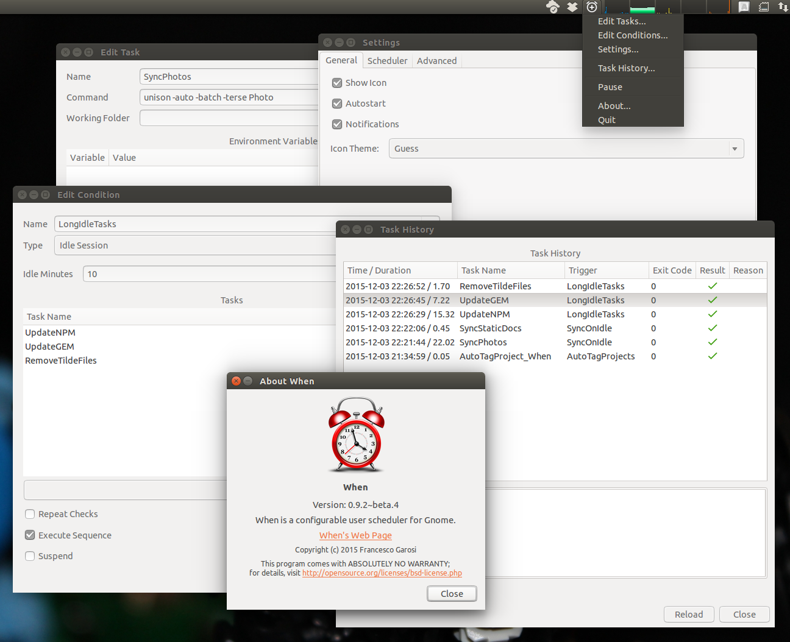

============
Introduction
============

**When** is a configurable user task scheduler for modern Gnome environments.
It interacts with the user through a GUI, where the user can define tasks and
conditions, as well as relationships of causality that bind conditions to
tasks. When a condition is bound to a task, it is said to trigger a task.

**When** is available in source_ or packaged_ form on GitHub_.

The purpose of this small utility is to provide the user, possibly without
administrative credentials, the ability to define conditions that do not only
depend on time, but also on a particular state of the session (e.g. the result
of a command run in a shell). The same result could be achieved with scripts
that periodically run commands, check the results and react accordingly, but
such a simple task could result in complex sets of scripts and settings that
would be harder to maintain. **When** was born out of need: I have been a
(happy) Ubuntu user for years now, and couldn't think of having a different
desktop environment than the one provided by Ubuntu. In *14.04 LTS* (the
release I'm using now) the environment is consistent and pleasant. One thing
I've noticed that has evolved in Windows is the *Task Scheduler*: in fact it
looks more useful and usable than the usual *cron* daemon, at least because it
allows some more options to schedule tasks than just the system time. I needed
such an utility to perform some file synchronizations when the workstation is
idle, and decided to write my own task scheduler targeted to Ubuntu. The
scheduler runs in the background, and displays an indicator applet icon for
user interaction.

It is not generally intended as a replacement to cron_ and the
`Gnome Task Scheduler`_, although to some extent these utilities might
overlap. **When** is intended to be more flexible, although less precise,
and to provide an alternative to more complicated solutions -- such as
the implementation of *cron* jobs that check for a particular condition
and execute commands when the condition is verified. In such spirit,
**When** is not as fine-grained in terms of doing things on a strict time
schedule: the **When** approach is that "*when* a certain condition is met,
*then* something has to be done". The condition is checked periodically,
and the countermeasure is taken *subsequently* in a relaxed fashion --
this means that it might not occur *immediately* in most cases. In fact
and with the default configuration, the delay could also consist of a
couple of minutes in the worst case.

.. _source: https://github.com/almostearthling/when-command
.. _packaged: https://github.com/almostearthling/when-command/releases
.. _GitHub: https://github.com/
.. _cron: https://en.wikipedia.org/wiki/Cron
.. _`Gnome Task Scheduler`: http://gnome-schedule.sourceforge.net/
