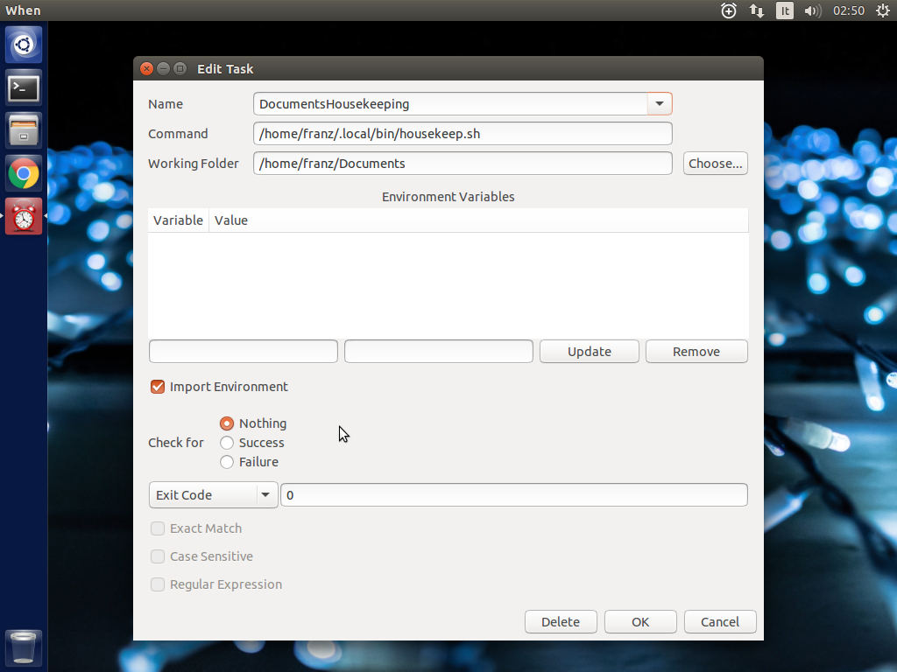

========
Tutorial
========

This tutorial's goal is to provide some *simple* examples to configure the
**When** applet to do useful things. Since it is a background application,
the examples shown here will focus on operations that would normally take
place without user interaction, such as file synchronization, file system
housekeeping and so on. However **When** can be used for many other *tasks*,
such as automated builds, gathering information, massive file conversions
and so on.

Assumptions
===========

**When** is explicitly aimed at Ubuntu desktops. Probably it would work on
other Linux flavors too, and especially on Ubuntu derivatives, maybe exposing
full or almost full functionality. However, for the sake of this tutorial,
I'll assume that the user is running **When** on *Ubuntu 14.04 LTS* or a more
recent release. Within the document the Ubuntu "idioms" will be constantly
used, and the examples will favor utilities such as ``apt-get`` and ``dpkg``
with respect to the corresponding ``yum`` and ``rpm`` of RPM-based distros.
*bash* is assumed to be the main shell, and will be used in scripts and
interactive shell examples, and administrative tasks will be prefixed by
``sudo`` as the Ubuntu custom suggests. Packages existing in standard
repositories will be referenced by their Ubuntu names. Since many packagers
have followed almost the same conventions to organize common packages on Linux
systems, it should not be too difficult to find appropriate name conversions
online.

I'll also assume that the following packages have been installed:

* ``python3-gi``
* ``xprintidle``
* ``python3-pyinotify``

as suggested in the documentation, as well as the **When** package from the
provided ``.deb`` file, following the suggested "easy" installation method,
and that the ``when-command`` executable is in the path. The applet itself
is assumed to be installed in the desktop and initialized for the user via

::

  $ when-command --install

and that the configuration still has not been modified from the default one
provided at initialization time. Long story short, I assume the user to have
a working default installation of **When** on a recent Ubuntu desktop.

Support Software
----------------

Some examples will use third-party open source software to perform tasks.
For example, I wrote **When** to be able to run Unison_ unattended on idle
time. *Unison* is a (beautiful and) useful piece of software, that doesn't
come with Ubuntu by default: in some examples the tutorial will also require
the user to install and configure *Unison* and other software.

.. _Unison: https://www.cis.upenn.edu/~bcpierce/unison/

Scripts
-------

In some cases it's easier to group actions in shell scripts, or even to
write simple programs, instead of relying on **When**'s sequential task run
ability. In such cases, apart from being embedded in the tutorial text, the
scripts are available in source form for download.

All possible effort is taken to make the scripts portable without modification,
and to make unavoidable modifications as easy as possible. In the latter case,
there will be instructions on how to modify the script.

The Examples
============

The provided examples illustrate simple tasks that could serve as a starting
point to build more complex actions. Me too, I started developing **When**
with very simpple goals in mind. Then **When** ended up including more
interesting features on which I also built some tools -- one_ of them is even
used to help develop **When** itself. The provided examples are about

* `File Synchronization and Backup`_
* Housekeeping_
* `Automatic Import`_ from a storage device.

The examples will try to cover the entire process of creating the tasks, their
trigger conditions and all the accessory parts and scripts needed for each
example to work from scratch. In particular, the tutorial will also try to
guide the user through the configuration process when different settings
from the default ones are needed.

.. _one: https://gist.github.com/almostearthling/7a26d24e5975a6dc5086

File Synchronization and Backup
-------------------------------

The first example illustrates how to synchronize files from a directory to a
backup destination. It uses *Unison* to copy the files from the source
location to the destination, only in one direction, whenever the contents
of the source directory change: in other words it implements a
*file change condition* to determine whether or not to backup the source
directory. Because such condition checks are always deferred, subsequent
writes to a file in the origin directory will not likely trigger the same
amount of synchronizations, which is good for backup tasks. Here we will
synchronize the ``~/Documents`` directory with a mounted location. We'll
assume there is a NFS disk mounted on ``/remote``, with a directory owned
by the user and named after the user name. To prepare the environment, a
proper backup location has to be created, via

::

  $ mkdir -p /remote/$USER/backup/Documents

in order to keep the environment as clean as possible. The path above is
supposed to act as a backup directory only, and to be left untouched unless
in case of need: this ensures that synchronization will always be
unidirectional.

For this example to function, the *file change conditions* have to be
enabled. To do this, open the settings dialog box by clicking on the applet
icon in the top panel and selecting *Settings...*.

.. image:: _static/s01_sync-settings01.png

Then click the *Advanced* tab and check the
*Enable File and Directory Notifications* entry. **When** has to be
restarted for the option to actually work: choose *Quit* from the applet
menu, then start **When** from the *dash*.

Install and Setup Unison
^^^^^^^^^^^^^^^^^^^^^^^^

A brief description follows on how to setup a simple profile in *Unison* for
the sake of this example. This utility can do much more, please refer to the
specific documentation for details.

Installation
~~~~~~~~~~~~

In Ubuntu *Unison* is provided in the official repositories, namely in
*Universe*. If that repository is enabled, you can install the software using

::

    $ sudo apt-get install -y unison unison-gtk

or via the *Ubuntu Software Center*. In this way you can use the *Unison* GUI
to configure the synchronization profile: launch *Unison* from *dash* to
access its interface (logout and login might be required to find the
application in *dash*).

Setup a Synchronization Profile
~~~~~~~~~~~~~~~~~~~~~~~~~~~~~~~

Open the *Unison* GUI: the main window will be presented, along with a dialog
box to select the profile to run. As there are no configured profiles, we
will click the *Add* button, and a wizard will help us with the creation of
a profile.

Click *Forward* and follow these easy steps:

1. Give the profile a name, ``DocsBackup`` for brevity, and a meaningful
   description: something like "Backup documents to a remote location"
   would do the job.
2. Choose *Local* as synchronization kind because a NFS mounted file system
   appears as local to *Unison*.
3. Choose your main `Documents` folder as *first directory*, and browse to
   ``/remote/<your_account>/backup/Documents`` for the *second folder* using
   the *Other...* entry in the choice box.
4. Obviously leave the option for FAT partitions unchecked.
5. Click *Apply*.

A basic profile is now created, which is enough for our purposes. The profile
name, ``DocsBackup``, will be used in the command passed to **When** to let
it perform the synchronization task.

To let **When** only do routine jobs, run the profile interactively by
opening it (use the *Open* button after selecting the profile). A dialog box
appears, to show that it's the first time that the folders are synchronized:
accept it, and click *Go* in the *Unison* main window. Now *Unison* can be
closed.

Create a Task
^^^^^^^^^^^^^

Click the **When** clock icon on the top panel, and select *Edit Tasks...* in
the menu. The *Task* creation dialog box will open.

As the screenshot suggest, a name has to be entered in the first dialog box
field: we choose ``SyncDocs``, which is mnemonic enough. In the *Command*
entry, the following command line has to be entered:

::

  unison -auto -batch -terse DocsBackup

This tells *Unison* (the non-graphical utility) to perform a synchronization
in automatic mode, asking no questions and with brief output. The other
entries in the dialog box are left alone: the working directory is not
influent, and we only care to know whether or not the synchronization task
succeeded by interpreting the command exit status. As it mostly happens with
command line utilities, *Unison* will return a zero exit code on success, and
the other entries in the box just tell **When** to consider this.

Click *OK* to create the task.

Setup a Condition
^^^^^^^^^^^^^^^^^

We are interested in propagating changes in the source directory to the
backup directory. The ideal solution is to create a condition based on
*file and directory changes*. Click the **When** clock icon on the top panel,
and select *Edit Conditions...* in the menu. The following dialog box will
let us define such a condition.

.. image:: _static/s01_sync-condition01.png

Then we will follow these steps:

1. Give the condition a meaningful name, such as ``SyncDocsOnChanges``.
2. Select *File Change* in the drop-down list below.
3. Click the *Choose...* button and select the main documents folder (that
   is, ``~/Documents``); alternatively the full path could be entered in the
   *Watch Files* field, which has the same effect.
4. Click the drop-down list under the list of tasks, and select ``SyncDocs``,
   then click the *Add* button on its right.
5. Click *OK* to enter the new condition.

All the other fields should be left alone: in this way the checks are periodic
(otherwise the synchronization would only take place once per session), while
the other options are ininfluent in this case, as there is only one task for
this condition.

Work and Let When do its Job
^^^^^^^^^^^^^^^^^^^^^^^^^^^^

We are ready now: we should only check that changes in the source directory
are reflected in the destination. A simple test will consist in the creation
of a file in ``~/Documents``:

::

  $ cd
  $ touch Documents/AnotherFile.txt
  $ ls -l /remote/$USER/backup/Documents

The following screenshots show how it worked: first is before creation

and after:

To check outcome directly from the **When** interface, we can open the
history window, by choosing *History...* in the applet menu.

This dialog box also shows the (brief) output of the command, which is useful
to identify task outcomes. If we click on the list items, the panes below will
show output (*stdout* and *stderr*) for the selected task.

Housekeeping
------------

In this tutorial we will instruct **When** to perform some simple
housekeeping in the *Documents* directory when the session has been idle for
a while. For the example we will use a minimal shell script that removes the
files that end in the `tilde` character (usually backups) and sends them to
the trash can. We need to use the ``trash`` command, which can be installed
with the *trash-cli* package:

::

  $ sudo apt-get install trash-cli

An alternative could be to directly remove the files, but this would be more
dangerous and we want to keep some kind of control on what is actually removed
from the disk.

Write the Shell Script
^^^^^^^^^^^^^^^^^^^^^^

Our script is essential, as said above, but nothing forbids to let it do more
complex tasks. To keep the things somewhat standard, we will put the script
in the ``~/.local/bin`` directory. At a terminal prompt, do the following:

::

  $ mkdir ~/.local/bin
  $ cd ~/.local/bin
  $ gedit housekeep.sh

When the Gnome editor starts, enter the following text:

::

  #!/bin/bash
  find . -type f -name '*~' -exec echo '{}' \; -exec trash '{}' \;

save the file, exit the editor and from the same terminal window run

::

  $ chmod a+x housekeep.sh

to make the script executable.

The ``housekeep.sh`` script is available here_.

.. _here: _static/housekeep.sh

Create the Task
^^^^^^^^^^^^^^^

From the **When** menu select the *Edit Tasks...* entry. When the
*task editor* box shows up, choose a meaningful name for the task:
``DocumentsHousekeeping`` will do the job. Then insert the following text
in the *Command* field:

::

  /home/<your_account>/.local/bin/housekeep.sh

(where ``<your_account>`` should be changed to your account name). Hit the
*Choose...* button to select the working folder and navigate to select the
``~/Documents`` directory. This is actually the reason why we just told the
``find`` command to start in the current directory: **When** will change
directory for us before starting the script, and we can use the same script
to create tasks that perform housekeeping in other directories, just changing
the startup directory.

Since we really don't care about task outcome and we don't want **When** to
throw an error when this task fails, we also select to check for *Nothing*
as outcome.

Click *OK* to accept the task.

Setup the Condition
^^^^^^^^^^^^^^^^^^^

We want this task to occur whenever the session has been idle for, say, three
minutes. It's not a very expensive task, so we accept it to run more than
once per session. To create the condition, select *Edit Conditions...* from
the applet menu. In the *condition editor* choose a meaningful name for the
item, such as `DocumentsHKeepOnIdle`, and choose *Idle Session* from the
drop-down list. Specify `3` in the *Idle Minutes* field, then using the
drop-down list below the task list, choose the ``DocumentsHousekeeping`` task
and click the *Add* button on the right. We can leave the other entries
alone.

.. image:: _static/s02_hkeep-condition01.png

Click *OK* to accept the condition, and we're done.

Verify that Everything Worked
^^^^^^^^^^^^^^^^^^^^^^^^^^^^^

After three or four (**When** is a lazy applet, though) minutes, you can open
the *History* box by selecting *Task History...* from the applet menu. The
window will show ``DocumentsHousekeeping`` triggered by
``DocumentsHKeepOnIdle`` in the main list, possibly among other tasks.

If you click the task line, you can verify what happened in the *Output* and
*Errors* tab below: because the script writes the name of each file it deletes
to *stdout*, the file names appear in the *Output* pane. Also note that the
desktop trash bin is now full, because ``Sample File.txt~`` was moved there.
As the condition from the previous example (``SyncDocsOnChanges``) has not been
removed, it has been triggered by the above defined task some seconds later.

Automatic Import
----------------

This example shows how to automatically import files from an external storage
device, such as an USB stick, when it's automatically mounted by the desktop
manager. Suppose we're using an USB stick to gather data and move it from some
device to our workstation. We assume that the USB stick has been given a label
(we'll call it ``USB2GB`` in this example) and that the device always writes
to the same ``Data`` directory on the stick, with no subdirectory: this makes
things easier, because we can use ``cp`` or ``mv`` to transfer files to the
hard disk.

Ubuntu always mounts external storage devices under the ``/media`` directory,
using ``/media/<label>`` as the actual mount point. So we can presume that our
USB stick will be mounted on ``/media/<your_account>/USB2GB``, and we can also
be reasonably sure that, if there is a ``/media/<your_account>/USB2GB/Data``
directory around just after insertion of a storage device, it must be the
place to gather data from. Naturally there should be better ways to determine
this. What we will do is blindly copy all files found in the device's ``Data``
folder to ``~/Documents/Gathered``, which has been created for this purpose
using the following command:

::

  $ mkdir ~/Documents/Gathered

A shell script will be used to perform the task, just because we'd like to:

* be notified by a badge reporting the operation outcome
* avoid to clutter the *Command* entry in the **When** *task editor* box
* have the script to unmount the USB stick if the copy succeeds.

The last step is less likely to be needed in the real world, as this would
cancel any possibility to read the contents of the device unless turning
off **When**.

We will make use of an USB stick (labeled ``USB2GB`` through *parted* or
*GParted* or any other disk labeling utility) which has a ``Data`` directory
with some crafted CSV files (ending in ``.csv``).

Create the Shell Script
^^^^^^^^^^^^^^^^^^^^^^^

Using the same technique shown in the second example, we will create a script
called ``gather_data.sh`` in ``~/.local/bin``, containing the following text:

::

  #!/bin/bash

  # this script expects two variables to be defined:
  # DEVICE_LABEL is the label given to the removable storage device
  # DESTINATION is the destination folder

  if [ -z "$DEVICE_LABEL"]; then exit 2; fi
  if [ -z "$DESTINATION"]; then exit 2; fi

  # shortcuts
  SOURCE_BASE="/media/$USER/$DEVICE_LABEL"
  SOURCE=$SOURCE_BASE/Data

  # exit if it's not the right USB key
  if [ ! -d "$SOURCE" ]; then
      exit 2
  fi

  # copy data from source base to destination
  cp -f $SOURCE/*.csv $DESTINATION

  # if the task was successful show a badge, if not When enters an error state
  if [ "$?" = "0" ]; then
      gvfs-mount -u $SOURCE_BASE
      notify-send -i info "Files successfully transferred, please remove device"
  else
      exit 2
  fi

Once written, do a ``chmod a+x gather_data.sh`` in the same directory from a
terminal window.

The ``gather_data.sh`` script is available `at this location`_.

.. Note::
  *A Tip for Photographers*

  Digital cameras nowadays use mostly SD cards (which contain well known
  directories, such as ``DCIM``) to store pictures: with adequate changes
  (such as copying ``*.jpg`` files from a different directory) this script can
  be helpful to transfer photos whenever a SD card is inserted. You can also
  use it for storage devices different from SD cards, as long as you correctly
  name the default dynamic mount point.

.. _`at this location`: _static/gather_data.sh

Create the Task
^^^^^^^^^^^^^^^

The corresponding *task* will need to consider the exit status of our script,
since we rely on it to show a failure badge on task failure: this is the
default with **When** when it's not instructed to avoid notifications on task
failures. So we will create a task with an adequate name
(``GatherExtStorageData``) that

* defines the two needed variables: ``DEVICE_LABEL`` and ``DESTINATION``
  (respectively with the label given to the external storage device and the
  destination folder)
* checks that the script exit code is ``0``.

To do this, we must open the *task editor* window by selecting
*Edit Tasks...* from the applet menu and then follow these steps:

1. enter ``GatherExtStorageData`` in the *Name* field
2. enter ``/home/<your_account>/.local/bin/gather_data.sh`` in the *Command*
   field (``<your_account>`` has to be replaced by your account name)
3. define the two needed variables, by writing the variable name
   (*remember that names are case sensitive!*) in the entry below the
   variable list, and its value in the adjacent text field and then hitting
   the *Update* button: ``DEVICE_LABEL`` should contain ``USB2GB``, and
   ``DESTINATION`` the full path to the destination directory, that is
   ``/home/<your_account>/Documents/Gathered`` where ``<your_account>`` is
   replaced by your account name.

The other entries must be left alone: the default *task* definition box is
already set up to look for task success by checking that the exit code is
zero. This is how the *task editor* box looks like after we defined the task:

You can click the *OK* button to store the *task item*.

Setup the Condition
^^^^^^^^^^^^^^^^^^^

The most adequate condition type here is the *event* based one: it allows to
choose a subtype that causes it to occur on storage device connection.
**When** is quite generic in this case, and does not actually communicate
to the user any details about the actual storage device. However, knowing
the expected dynamic mount point helps in writing scripts -- like the one
above -- that only work when the correct device has been inserted.

To define the condition we will select *Edit Conditions...* entry from the
applet menu and carry the following operations when the dialog box appears:

1. give the condition a meaningful name, such as ``GatherDataOnInsert``
2. select *Event* from the *Type* drop-down box: the dialog layout will
   change and a second drop-down list appears
3. select *Connect Storage Device* from the following drop-down list, that
   just appeared
4. using the combo box under the task list, choose ``GatherExtStorageData``
   and hit the *Add* button.

This is sufficient and other entries could be left alone. Click *OK* to
accept.

Cause Something to Happen
^^^^^^^^^^^^^^^^^^^^^^^^^

We just have to insert the USB key to let **When** work now. After a while a
notification will inform us that the files have been successfully copied to
the destination directory. If we open the *task history* box by choosing
*Task history...* from the applet menu

.. image:: _static/s03_usb-ver01.png

we can check that the task actually succeeded at any time. Using ``ls``, for
instance, or *Nautilus*, you can also verify that all files have been copied
to the destination.

The Tutorial is an Ongoing Task
===============================

This tutorial was formerly a project by itself, and now is part of a
bigger project focusing on structured documentation, also to allow it to
grow with time: for now it consists of very simple examples, but **When**
can be also used to automate complex tasks. It can be useful for developers,
photographers, people that need to automate data gathering or processing and
so on: feel free to provide or just even suggest more examples using the
*issue* mechanism in the documentation repository.
