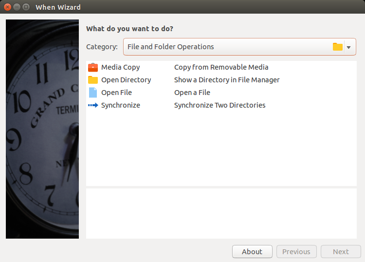
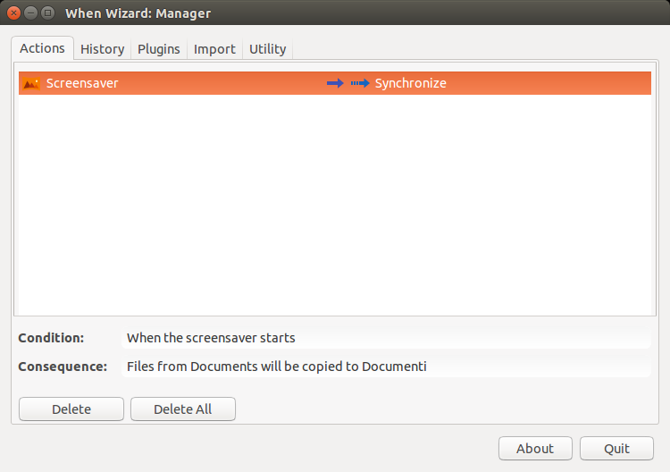

===============
The When Wizard
===============

The **When Wizard** is a suite of utilities that aim at providing an easier
user interface for a rich subset of **When**'s capabilities, in order to
give to end users with lesser interest in programming and scripting the
possibility to use the **When** scheduler to perform simple but useful
tasks. In fact, the use of **When** as it is assumes a certain knowledge
of the command shell, including its constructs and peculiarities, which is
somehow in contrast with the GUI nature of the applet itself.

.. Warning::

  This section refers to software in its early development stage: it may
  contain bugs and errors, and it might be subject to changes in both
  appearance and functionality. The documentation will be kept as updated
  as possible, however there might be a gap sometimes between updates to
  the software and related documentation changes.

As the name suggests, the main **When Wizard** application presents itself
with a *wizard* styled interface, which allows to define what has to be done
and the circumstances under which it has to happen in a more intuitive
step-by-step fashion. **When** is still used to do most of the job, that is
scheduling checks, listening to events and performing tasks when the
conditions are met, but the wizard instructs it on how to behave instead
of requiring the user to find out what commands and events have to be
specified in its low-level interface. [#warnuseboth]_

While the wizard interface is used to define tasks and conditions, there is
another utility, named the **When Wizard Manager**, which can be used for
several tasks, including the removal of *actions* (tasks surrounded by
circumstances) that are of no more needed, viewing the history of past
action in a simplified way and environment tuning. Thanks to the modular,
extensible nature of the **When Wizard** suite, the manager application can
also be used to install plugins for actions that are not available by default
in the distribution.

This chapter intends to give a brief introduction to the **When Wizard**
suite: apart from some specific **When Wizard Manager** configuration options
the interface is designed to be as intuitive as possible, and the actions
are documented in the interface.

.. [#warnuseboth] If you want to use *both* types of interface, avoid names
  beginning with the ``00wiz99_`` prefix for *tasks*, *conditions* and
  *signal handlers* when using the **When** base interface: this sequence
  is used by the wizard to identify its own items. It is otherwise perfectly
  legal and can be used if you plan to use **When** alone.
