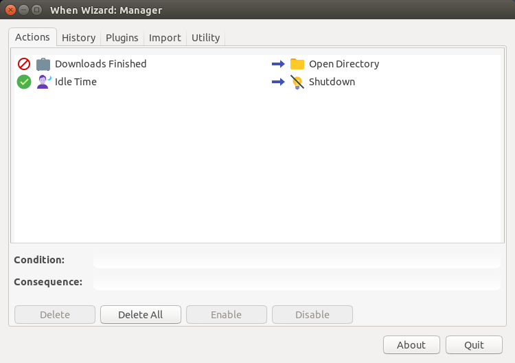
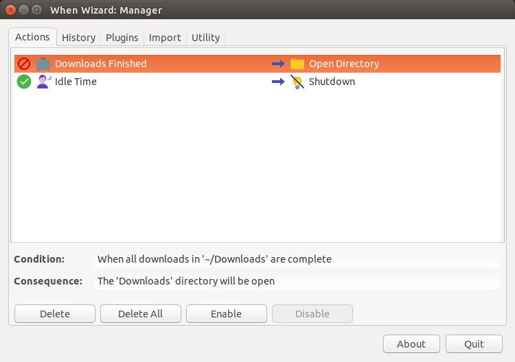

===============
The When Wizard
===============

The **When Wizard** is a suite of utilities that aim at providing an easier
user interface for a rich subset of **When**'s capabilities, in order to
give to end users with lesser interest in programming and scripting the
possibility to use the **When** scheduler to perform simple but useful
tasks. In fact, the use of **When** as it is assumes a certain knowledge
of the command shell, including its constructs and peculiarities, which is
somehow in contrast with the GUI nature of the applet itself.

.. Warning::

  This section refers to software in its early development stage: it may
  contain bugs and errors, and it might be subject to changes in both
  appearance and functionality. The documentation will be kept as updated
  as possible, however there might be a gap sometimes between updates to
  the software and related documentation changes.

As the name suggests, the main **When Wizard** application presents itself
with a *wizard* styled interface, which allows to define what has to be done
and the circumstances under which it has to happen in a more intuitive
step-by-step fashion. **When** is still used to do most of the job, that is
scheduling checks, listening to events and performing tasks when the
conditions are met, but the wizard instructs it on how to behave instead
of requiring the user to find out what commands and events have to be
specified in its low-level interface. [#warnuseboth]_

While the wizard interface is used to define tasks and conditions, there is
another utility, named the **When Wizard Manager**, which can be used for
several tasks, including the removal of *actions* (tasks surrounded by
circumstances) that are of no more needed, viewing the history of past
action in a simplified way and environment tuning. Thanks to the modular,
extensible nature of the **When Wizard** suite, the manager application can
also be used to install plugins for actions that are not available by default
in the distribution.

This chapter intends to give a brief introduction to the **When Wizard**
suite: apart from some specific **When Wizard Manager** configuration options
the interface is designed to be as intuitive as possible, and the actions
are documented in the interface.

Installation
============

At the moment, there is no proper installation procedure nor distribution
specific package. However getting the **When Wizard** to work is quite easy
anyway: it is sufficient to either clone the GitHub repository_ or download
and unpack the zip_ file from the master branch. It may be useful to move
the resulting directory (and maybe rename it in case the zip file as been
used) in a folder where applications reside. Assuming that the zip file
method was chosend and that the ``when-wizard-master.zip`` file is now in
``~/Downloads``:

::

  ~$ mkdir Apps     # or another name you might like
  ~$ cd Downloads
  ~/Downloads$ unzip when-wizard-master.zip
  ~/Downloads$ mv when-wizard-master ../Apps/when-wizard
  ~/Downloads$ cd ..
  ~$

To start the **When Wizard** is now sufficient to

::

  ~$ cd Apps/when-wizard
  ~/Apps/when-wizard$ ./when-wizard start-wizard

while for the manager application, the subcommand changes:

::

  ~$ cd Apps/when-wizard
  ~/Apps/when-wizard$ ./when-wizard start-manager

.. Note::

  The ``when-wizard`` command is already marked as *executable* in the
  repository, however, should the shell refuse to execute the command,
  it is sufficient to ``cd`` to the installation directory and issue
  ``chmod a+x when-wizard``.

Using the **When Wizard Manager** it is possible to create icons for both
the wizard and the management application: once the **When Wizard Manager**
started, choose the *Utility* tab and click on the check box labeled
*Create or Restore Icons for Wizard Applications*, then click the *Apply*
button:

The icons for **When Wizard** and for the **When Wizard Manager** should
now be available in the *Dash* or whatever menu system is used.

.. _repository: https://github.com/almostearthling/when-wizard.git
.. _zip: https://github.com/almostearthling/when-wizard/archive/master.zip

Defining Actions
================

Action definition is simple, but there are many different choices for tasks
and surrounding conditions to be described in detail. However, whenever a
task or a condition is chosen in the list proposed by the wizard interface,
descriptive text is provided along with the name of the item, and in the
lower part of the form a longer description appears that better specifies
what has been selected:

Task and condition items are grouped in categories and types, which can be
chosen from the drop-down list at the beginning of the window. The interface
proposes to decide what task has to be accomplished and *then* to define the
circumstances under which it should happen. Most items have to be configured
and after their selection a simple configuration page is presented to the
user:

The configuration page depends obviously on the selected item. Once the task
and circumstance have been chosen and possibly configured, by clicking the
*Forward* button it is possible to review what has been configured:

here the user is still in time to change her or his mind and either modify
anything or completely abort the operation by pressing the *Esc* key (or just
closing the window). If the *Forward* button is clicked, the action is
registered in **When**.

Removing Actions
================

Actions can be removed through the **When Wizard Manager** application. On
startup it shows a list containing the actions currently defined using the
wizard interface: [#whenleftalone]_

To remove an action it is sufficient to select it from the list (a more
detailed description is shown under the list) and click the *Delete* button.
After confirmation, the action is completely removed from the system.

.. [#warnuseboth] If you want to use *both* types of interface, avoid names
  beginning with the ``00wiz99_`` prefix for *tasks*, *conditions* and
  *signal handlers* when using the **When** base interface: this sequence
  is used by the wizard to identify its own items. It is otherwise perfectly
  legal and can be used if you plan to use **When** alone.
.. [#whenleftalone] Other actions directly defined in **When** are left
  untouched by the **When Wizard Manager**: of course it is advisable to
  choose one and only one interface for **When** and avoid its base UI if
  the wizard approach is chosen, but in this way it is anyway possible to
  avoid that the wizard interface could mess up a configuration made at
  lower level, for example using third party *item definition files*.
